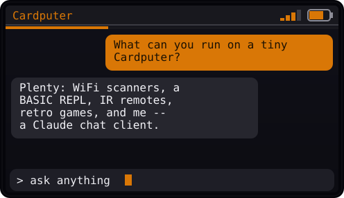

# Claudeputer

Chat with **Claude** from an **M5Stack Cardputer**, over WiFi. ⌨️🤖

<p align="center">
  
  <br>
  <sub><i>Illustration of the on-device chat UI (not a photo).</i></sub>
</p>

The Cardputer connects to WiFi, you type a question on the keyboard, it's sent
to Anthropic's Messages API, and the reply **streams back** on screen as chat
bubbles. Works on both the Cardputer 1.1 and the Cardputer ADV.

> ⚡ **No toolchain needed** — flash it straight from your browser:
> **[Web Flasher](https://poppnn.github.io/claudeputer/)**.

---

## One firmware, both boards

The same image runs on the **Cardputer 1.1** and the **Cardputer ADV**. They
share the ESP32-S3 SoC and the ST7789 display; only the keyboard controller
differs (IO-matrix on 1.1, TCA8418 on ADV). The `M5Cardputer` library (≥ 1.2.0)
**auto-detects the board at runtime** via `M5.getBoard()` and selects the right
keyboard driver — so a single binary covers both.

| Device            | Status | Notes                                       |
|-------------------|--------|---------------------------------------------|
| Cardputer **1.1** | ✅     | IO-matrix keyboard                          |
| Cardputer **ADV** | ✅     | TCA8418 I²C keyboard, auto-detected         |

---

## Install

### Option A — Web Flasher (easiest)

1. Open the **[Web Flasher](https://poppnn.github.io/claudeputer/)** in desktop
   **Chrome** or **Edge** (Web Serial API required).
2. Plug in the Cardputer via USB-C, click **Connect & Install**, pick the serial
   port. If nothing shows up, hold **G0** (top button) while plugging in.
3. After flashing, the Cardputer boots into on-device setup (see below).

### Option B — Build from source

With [PlatformIO](https://platformio.org/) (VS Code extension):

```bash
git clone https://github.com/poppnn/claudeputer
cd claudeputer
pio run -e cardputer -t upload      # works on both 1.1 and ADV
pio device monitor                  # serial logs
```

Or with the **Arduino IDE**: install ESP32 board support, select **M5Stack
StampS3** (PSRAM enabled), install the **M5Cardputer** (≥ 1.2.0) and
**ArduinoJson** (v7) libraries, then build `src/main.cpp` as a sketch.

> Baking credentials in at compile time is optional — see
> [`src/config.h.example`](src/config.h.example). By default the device is
> configured on-device, no `config.h` required.

---

## First boot — on-device setup

No secrets are embedded in the firmware. On first boot a setup wizard appears:

1. **WiFi SSID** → `ENTER`
2. **WiFi password** → `ENTER`
3. **Anthropic API key** ([get one](https://console.anthropic.com/settings/keys)) → `ENTER`

Settings are stored on the device (NVS) and survive reboots. The API key only
ever leaves the device to reach `api.anthropic.com`.

To reconfigure later: type `/setup` + `ENTER`, **or** hold **G0** while powering on.

---

## Usage

A single chat view: your messages appear as orange bubbles on the right,
Claude's on the left, with a status bar (WiFi + battery) on top, a thin
**token-usage bar** under it, and a rounded input bar at the bottom. Replies
**stream in live** (token by token). Errors and the "typing" state show inline.

| Key            | Action                                   |
|----------------|------------------------------------------|
| *(type)*       | Write your prompt                        |
| `ENTER`        | Send to Claude                           |
| `DEL`          | Backspace                                |
| `Fn` + `;`/`.` | Scroll the transcript up / down          |
| `/setup`       | Reconfigure WiFi / API key               |
| `/reset`       | Clear the conversation                   |
| `/tokens`      | Show token usage (in/out, session, cost) |
| `/model`       | Pick the Claude model (saved to NVS)     |
| `/save`        | Save the conversation to microSD         |
| `/load`        | Load the most recent saved conversation  |
| `/sd`          | Show microSD status                      |
| `/help`        | List all commands                        |

New replies auto-scroll to the bottom. Conversation history is kept
(`MAX_HISTORY_TURNS` turns) so Claude has context.

**Model picker** (`/model`): choose between Haiku / Sonnet / Opus with `;`/`.`,
`ENTER` to confirm (`` ` `` cancels). The choice persists across reboots.

**Save to SD** (`/save`, `/load`): conversations are stored as JSON under
`/claudeputer/chat-NNN.json` on the microSD card. `/load` restores the latest.

**Token usage:** the bar fills as you spend tokens this session (relative to
`TOKEN_BUDGET`), turning red near the limit. `/tokens` prints exact input/output
counts and an estimated cost — set `PRICE_*_PER_MTOK` in `config.h` to match your
model (defaults are Claude Haiku 4.5: in $1 / out $5 per 1M tokens). Default
model is `claude-haiku-4-5` (fast & cheap, ideal for a tiny screen).

---

## How it works

```
Cardputer ──WiFi──> HTTPS POST api.anthropic.com/v1/messages
   │                     headers: x-api-key, anthropic-version
   │                     body: { model, system, messages[] }
   └──< JSON response ── content[].text ──> scrollable display
```

- Config priority: on-device NVS values override compile-time `config.h`.
- TLS validated against embedded root CAs ([`src/anthropic_ca.h`](src/anthropic_ca.h));
  the clock is synced over NTP at boot so the certificate dates check out.
  Set `TLS_INSECURE` in `config.h` to bypass (debug only).
- JSON via **ArduinoJson v7**.

---

## Web flasher & CI

`webflasher/` holds the [ESP Web Tools](https://esphome.github.io/esp-web-tools/)
page. On every push to `main`, the workflow in
[`.github/workflows/deploy.yml`](.github/workflows/deploy.yml):

1. builds the firmware with PlatformIO,
2. merges bootloader + partitions + app into one `.bin` (`esptool merge_bin`),
3. publishes the flasher + binary to **GitHub Pages**.

> Requires Pages to be set to the **GitHub Actions** source (Settings → Pages).

---

## Done & next ideas

Done: chat-bubble UI · streaming replies · token usage bar + `/tokens` ·
TLS certificate validation (embedded roots + NTP) · on-screen `/model` picker ·
`/save` & `/load` to microSD.

Next:
- [ ] Multi-line input + cursor editing
- [ ] On-screen `max_tokens` / system-prompt settings
- [ ] Browse & pick which saved conversation to load
- [ ] Use the ADV's extras (IMU, mic, speaker, IR)

---

## License

MIT — see [LICENSE](LICENSE).
